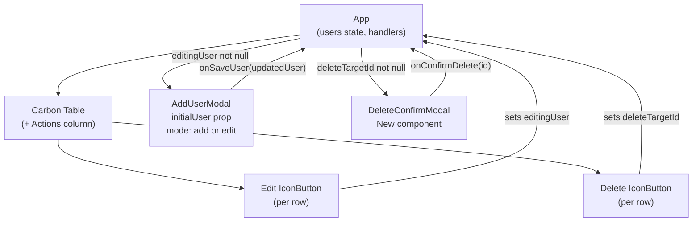

# PRD: Edit and Delete User Functionality

## Summary
The Users Directory table currently allows adding new users but provides no way to update or remove existing records. This PRD adds an **Actions column** to each table row with an Edit icon button and a Delete icon button. Edit opens a pre-populated Carbon Modal (same 5 fields, same validation as Add User) where the user can save changes. Delete opens a Carbon danger Modal for confirmation before removing the record. Both actions update in-memory React state and are reflected immediately in the table.

## User Stories
1. As a team admin, I want to edit an existing user's details so that I can correct mistakes or reflect role/location changes without deleting and re-adding the user.
2. As a team admin, I want to delete a user so that I can remove people who have left the team.
3. As a team admin, I want to confirm before deleting so that I don't accidentally remove a user.

## Acceptance Criteria
- **AC-1:** An "Actions" column header appears as the last column in the Users table. Each row contains an Edit icon button and a Delete (TrashCan) icon button in that column.
- **AC-2:** Clicking the Edit icon button for a user opens a Carbon Modal with heading "Edit User", pre-populated with that user's current name, email, role, location, and status values.
- **AC-3:** The Edit modal applies the same validation rules as Add User: all fields required, email must match the regex pattern. Submitting with invalid data shows inline errors and does not call the save handler.
- **AC-4:** Submitting a valid Edit form updates the corresponding user row in the table (all 5 fields reflect the new values) and closes the modal. No other rows are affected.
- **AC-5:** Clicking the Delete icon button for a user opens a Carbon danger Modal naming the user (e.g. "Delete Ava Johnson?") with a "Delete" primary button and a "Cancel" secondary button.
- **AC-6:** Clicking "Cancel" in the delete confirmation modal closes the modal without removing any row.
- **AC-7:** Clicking "Delete" in the confirmation modal removes that user's row from the table and closes the modal.
- **AC-8:** After an edit, the edited user retains their original `id`; no other user's `id` changes.

## Technical Design

### Approach
- **`src/App.jsx`**: Add two new state variables — `editingUser` (null or a user object) and `deleteTargetId` (null or a user id). Add `handleSaveUser(updatedUser)` that maps over `users` and replaces the matching id. Add `handleConfirmDelete(id)` that filters `users` to remove the matching id. Render an Actions column in the table with `<IconButton>` for Edit and Delete per row. Mount `<AddUserModal>` in edit mode when `editingUser != null`, and mount `<DeleteConfirmModal>` when `deleteTargetId != null`.
- **`src/AddUserModal.jsx`**: Accept an optional `initialUser` prop. Use a `useEffect` keyed on `initialUser` to populate/reset `fields` state when the prop changes. When `initialUser` is provided: modal heading = "Edit User", primary button = "Save", and `onRequestSubmit` calls `onSaveUser` instead of `onAddUser`.
- **`src/DeleteConfirmModal.jsx`** *(new)*: A thin wrapper around Carbon `<Modal danger>` that accepts `userName`, `isOpen`, `onClose`, and `onConfirmDelete` props. Renders heading "Delete {userName}?" with "Delete" and "Cancel" buttons.

### Architecture Diagram

### Files to Create / Modify
| File (path) | Change | Reason |
|---|---|---|
| `src/App.jsx` | Add `editingUser`, `deleteTargetId` state; `handleSaveUser`, `handleConfirmDelete` handlers; Actions column in table; mount both modals | Orchestrates all state and event wiring |
| `src/AddUserModal.jsx` | Add optional `initialUser` prop; `useEffect` to sync fields; conditional heading/button label | Reuses existing modal + validation for edit mode |
| `src/DeleteConfirmModal.jsx` *(new)* | Carbon `<Modal danger>` with user name in heading, "Delete"/"Cancel" buttons, `onConfirmDelete`/`onClose` props | Delete confirmation UI |
| `src/test/App.test.jsx` | Add integration tests covering AC-1, AC-2, AC-4, AC-5, AC-7 | Integration coverage |
| `src/test/AddUserModal.test.jsx` | Add tests for AC-2 pre-population and AC-3 edit-mode validation/submit | Unit coverage for modal in edit mode |
| `src/test/DeleteConfirmModal.test.jsx` *(new)* | Unit tests for AC-5, AC-6, AC-7 | Unit coverage for new component |

### Data / API Changes
None. All state is in-memory (`useState` in `App.jsx`). No schema, endpoint, or persistence changes.

## Test Strategy
- **Unit tests** (`src/test/AddUserModal.test.jsx`): pre-population (AC-2), edit-mode validation (AC-3), edit-mode submit (AC-4 at unit level), id preservation (AC-8).
- **Unit tests** (`src/test/DeleteConfirmModal.test.jsx`): modal renders with correct user name (AC-5), Cancel fires `onClose` without `onConfirmDelete` (AC-6), Delete fires `onConfirmDelete` (AC-7).
- **Integration tests** (`src/test/App.test.jsx`): Actions column visible (AC-1), edit button opens pre-populated modal (AC-2), save updates row (AC-4), delete button opens confirmation (AC-5), confirmed delete removes row (AC-7).
- All tests follow existing conventions: `fireEvent`, `describe/it`, AC-labelled comments, files in `src/test/`.

## Effort & Risk
**Size: M** — 3 files to modify, 1 new component, 2 test files to extend/create; no routing, no API, no persistence.

| Risk | Severity | Mitigation |
|---|---|---|
| Stale modal state: `AddUserModal` kept mounted with stale `initialUser` could show old data | Medium | `useEffect` keyed on `initialUser` resets `fields` every time the prop changes |
| Icon button accessibility: `IconButton` requires `aria-label` for test queries and screen readers | Low | Set descriptive `aria-label` on each icon button (e.g. "Edit Ava Johnson", "Delete Ava Johnson") |

## Jira
**Key:** SCRUM-8
**Type:** Story
**URL:** https://manoo-team.atlassian.net/browse/SCRUM-8
