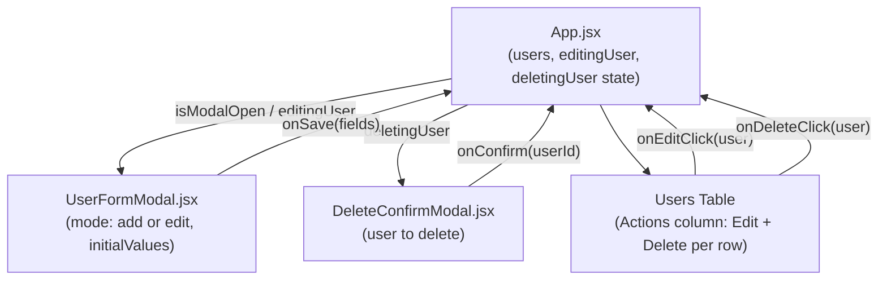

# PRD: Edit and Delete User Functionality

## Summary
The Users Directory app currently allows adding new users but provides no way to modify or remove existing ones. This feature introduces per-row **Edit** and **Delete** action buttons to the users table. Editing opens a pre-filled Carbon Modal (refactored from the existing `AddUserModal` into a shared `UserFormModal`) where all five user fields can be updated with the same validation rules. Deleting shows a Carbon confirmation modal before removing the user from state. All mutations remain in-memory only, consistent with the existing Add flow. The primary users are internal team members managing the users directory.

## User Stories
1. As a team admin, I want to edit an existing user's details, so that I can correct mistakes or update information without deleting and re-adding the user.
2. As a team admin, I want to delete a user with a confirmation step, so that I can remove stale entries without accidentally losing data.
3. As a developer, I want the Add and Edit flows to share a single form component, so that validation logic and UI are maintained in one place.

## Acceptance Criteria
- **AC-1:** An "Actions" column is visible as the last column in the users table, containing an Edit icon button and a Delete icon button on every user row.
- **AC-2:** Clicking the Edit button for a user opens a modal with the heading "Edit User" and all five fields (Name, Email, Role, Location, Status) pre-filled with that user's current values.
- **AC-3:** Submitting the Edit form with valid data updates the user's row in the table in-place (same row position, updated values) and closes the modal.
- **AC-4:** Submitting the Edit form with any invalid data (empty required field or malformed email) shows the same inline validation errors as the Add flow and does not update the user.
- **AC-5:** Clicking the Delete button for a user opens a confirmation modal that names the user (e.g., "Delete Ava Johnson? This action cannot be undone.").
- **AC-6:** Confirming the deletion removes exactly that user's row from the table and closes the confirmation modal.
- **AC-7:** Cancelling the delete confirmation (via Cancel or the X button) leaves the user's row intact and closes the confirmation modal.
- **AC-8:** The `AddUserModal` form/validation logic is consolidated into a shared `UserFormModal` component; the existing Add User flow continues to work identically.

## Technical Design

### Approach
- Refactor `src/AddUserModal.jsx` into `src/UserFormModal.jsx`. Add a `mode` prop (`'add'` | `'edit'`, default `'add'`) and an `initialValues` prop. In edit mode, seed the form state from `initialValues` instead of `EMPTY_FORM`, and set the modal heading to "Edit User" and primary button to "Save".
- Add `src/DeleteConfirmModal.jsx`: a minimal Carbon `Modal` that receives a `user` object and `onConfirm`/`onClose` callbacks. Shows "Delete {user.name}? This action cannot be undone."
- In `src/App.jsx`:
  - Add `editingUser` state (null or a user object) and `deletingUser` state (null or a user object).
  - Add an Actions `TableHeader` and, per row, two ghost icon `Button`s: `Edit` icon (sets `editingUser`) and `TrashCan` icon (sets `deletingUser`).
  - Add `handleEditUser(updatedFields)` — maps over `users`, replaces the matching `id` entry, calls `setUsers`, clears `editingUser`.
  - Add `handleDeleteUser(id)` — filters `users`, calls `setUsers`, clears `deletingUser`.
  - Render `<UserFormModal>` for both add (using `isModalOpen`) and edit (using `editingUser`) — only one is open at a time.
  - Render `<DeleteConfirmModal>` driven by `deletingUser`.

### Architecture Diagram

### Files to Create / Modify
| File (path) | Change | Reason |
|---|---|---|
| `src/UserFormModal.jsx` | **Create** (refactored from `AddUserModal.jsx`) | Shared modal for both Add and Edit; accepts `mode` and `initialValues` props |
| `src/AddUserModal.jsx` | **Delete** | Replaced by `UserFormModal.jsx` |
| `src/DeleteConfirmModal.jsx` | **Create** | Carbon Modal confirmation for delete action |
| `src/App.jsx` | **Modify** | Add Actions column; wire `editingUser`/`deletingUser` state; replace `AddUserModal` with `UserFormModal`; add `handleEditUser`/`handleDeleteUser` |
| `src/test/UserFormModal.test.jsx` | **Create** (replaces `AddUserModal.test.jsx`) | Unit tests for the shared form modal covering both add and edit modes |
| `src/test/AddUserModal.test.jsx` | **Delete** | Replaced by `UserFormModal.test.jsx` |
| `src/test/App.test.jsx` | **Modify** | Add integration tests for AC-1 through AC-8 |

### Data / API Changes
None. All state is in-memory React `useState`. User object shape is unchanged: `{ id, name, email, role, location, status }`.

## Test Strategy
- **Unit tests** (`src/test/UserFormModal.test.jsx`): test add mode (existing 10 tests, updated for new component name/props) + edit mode (pre-fill, save, validation still fires). Maps to AC-2, AC-3, AC-4, AC-8.
- **Integration tests** (`src/test/App.test.jsx`): render full `<App />`, simulate clicking Edit/Delete buttons per row. Maps to AC-1, AC-2, AC-3, AC-5, AC-6, AC-7.
- All tests use `fireEvent` + `render` per existing convention.

## Effort & Risk
**Size: S** — All UI is Carbon components already in use; state mutations follow the exact pattern of the existing Add flow; no backend or routing changes.

| Risk | Severity | Mitigation |
|---|---|---|
| Renaming `AddUserModal` → `UserFormModal` must update all import sites and test files atomically | Medium | Delete old files and update all references in a single commit |
| Carbon icon names (`Edit`, `TrashCan`) must exist in `@carbon/icons-react` v11.83 | Low | Both are stable Carbon icons; verify import at implementation time |

## Jira
**Key:** SCRUM-6
**Type:** Story
**URL:** https://manoo-team.atlassian.net/browse/SCRUM-6
